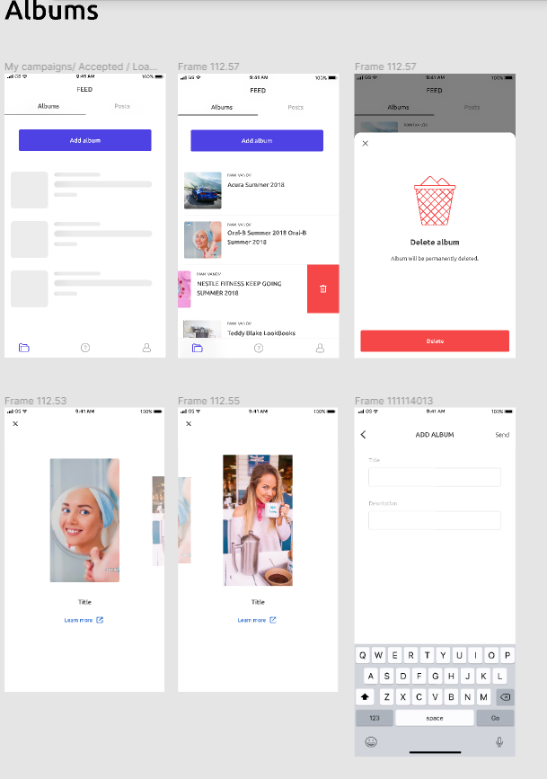
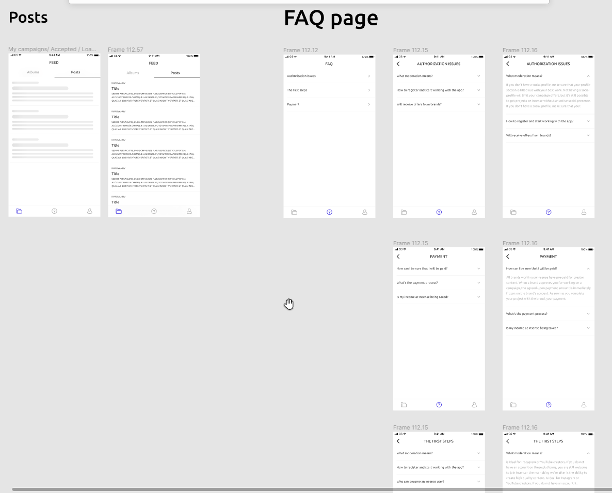
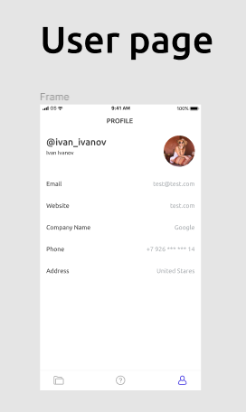

# Тестовое задание: Социальные Альбомы (React Native + GraphQL)

# Содержание
- [Задание](#t1_1)
- [Cтруктура приложения](#t1_2)
    - [Feed page](#t1_2_1)
    - [FAQ page](#t1_2_2)
    - [User page](#t1_2_3)
- [Реализация](#t2)
    - [Общение описание](#t2_1)
    - [Запуск](#t2_2)
    - [План работы](#t2_3)
    - [Остальные задачи](#t2_4)

# Change log
[Actual CHANGELOG.MD](./CHANGELOG.md)

# Задание
Создать мобильное приложение на React Native. 

Для серверного взаимодействия используется тестовый сервер на Graphql https://graphqlzero.almansi.me/api.

Макет https://www.figma.com/file/gOT6KU7omHF42dRR9Y7R7C/React-Native-Test-Task

## Cтруктура приложения
Приложение состоит из трех страниц.

### Feed page
Feed page разделен на два таба.

Первый таб подгружает контейнер с альбомами (query.albums), второй таб подгружает посты (query.posts). 

Список элементов сначала подгружается 20 первых постов/альбомов, при скролле вниз подгружается следующие 20 элементов. 

На макетах указан прелоудер при первичной подгрузке + при подгрузке дополнительных элементов. 

Альбом можно удалить, свайпнув элемент влево и кликнув на кнопку удаления, открывается попап с преудпреждением об удалении. При подтверждении срабатывает запрос на удаление (mutation.deleteAlbum) и элемент пропадает из списка.

Также на альбоме можно нажать на картинку (картинка берется из первого элемента списка query.album.photos) и открывается модалка с галлерей отображающей все картинки альбома (перелистывание работает через свайп). Помимо самой картинки, меняется и тайтл и внешняя ссылка. 

Также на табе альбомы есть кнопка создания альбома. При нажатии открывается модалка с вводом данных для создания альбома (из данных заполняется title и description, пока поля не будут заполнены отправка данных должна быть заблокирована). При сабмите данной формы уходит запрос на создание альбома (mutation.createAlbum). После этого модалка закрывается и новый альбом добавляется первым в список альбомов.

### FAQ page
Страница с ответами на вопросы с вложенной структурой. При выборе темы вопроса переход в блок с вопросами по этой теме. При клике на вопрос открывается ответ.

Для неуказанных пунтков в макетах использовать рыбный текст.

### User page
Отображение данных о текущем пользователе (query.user  с параметром id: ’1’).

## Особенности
Все мутации должны отрабатывать с optimistic updates (важно учитывать, что после выполнения запросов база данных не меняется на тестовом сервере).

# Реализация
## Общение описание
Стек технологий:
- React Native 
- Expo Cli - для разворачивания и удобства разработки (под веб, эмулятор, мобильник)
- react-navigation
- Apollo Client -  для graphQL и хранения \ кеширования данных (вместо redux)
- AsyncStorage - для персистинга данных приложения
- react-native-paper - компоненты, стилизация и темы
- react-hook-form - управления и валидация форм

## Запуск
1. Web
`npm run web`
http://localhost:19002/ - веб консоль и управление
http://localhost:19006/ - адрес web версии
1. Emulation
Запустите Android Studio. Запустите эмулятор и дождитесь загрузки.
В терминале к запущенному expo нажмите: "a" (for Android)
1. Mobile
Use QR-code from http://localhost:19002/

## План работы
1. ~~Изучить задание, наметить архитектуру~~
1. ~~развернуть проект \ подобрать boilerplate~~
1. ~~eslint \ tslint~~
1. ~~При комитах автопроверка, версионирование, change log через husky~~ 
1. ~~раутинг на react-native~~
1. ~~подключить graphql: чтение основных данных~~
1. ~~компонент лист со свайпами (для albums)~~
1. ~~компонент слайдер (для album view)~~
1. ~~load more для списков~~
1. ~~стилизовать в соответствии с дизайном экраны (Feed, FAQ, Profile)~~
1. ~~стилизовать экран "добавить альбом" (форма, портал)~~
1. ~~стилизовать компонент модального confirm окна снизу~~
1. ~~подгрузить кастомные иконки~~
1. мутации на GQL (удаление и создание)
1. пользователя подгружать
1. компонент скелетоны при загрузки
1. решить остальные важные \ опциональные задачи
1. рефакторинг (по возможности)

## Остальные задачи
- генерация TS схема для gql
- сбрасывать stack при клике на футер табу
- ~~fetchQuery~~
- подключить тестирование
- ~~выделить модули~~
- локализация
- вынести конфиги
- splash image

# Итоги
TODO
